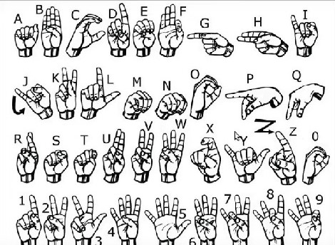

# Tugas Bootcamp AI Kelompok 1

## Anggota Kelompok
1. Ariq Fadhilah Jeha ***[ketua]***
2. Alex Cinatra
3. Awaliya Shabrina
4. Annisa Nabila
5. Laila Nur Rizqi Tasnimiyah
6. Benaya Imanuela

## Projects Overview
| | |
|--|--|
|***Topic:***|_Human Impaired_|
|***Title:***|_scikit-learn & mediapipe: SignLanguage untuk membantu turnarunggu dalam berkomunikasi dengan orang yang kurang mengerti bahasa mereka_|
|***Description:***|_Proyek ini memberikan kesempatan untuk berkomunikasi dengan penyandang turnarunggu dengan memberikan huruf info yang diberikan melalui sign hand atau bahasa isyarat_|

## Target and Points of the Application
1. Give the chance for the deaf person and normal person to comunicate ~***[check]***~
2. Makes commication between deaf person and normal person becomes easier ~***[check]***~

## Simple Use Case of the Program
1. Deaf Peson comunicate using the sign language
2. The words are formed
3. And the Voice will came up so the normal person can understand

## About Library
1. mediapipe for handslandmark recognition
2. scikit-learn _[ ***using RandomForestTree*** ]_
3. nltk for spelling check
4. pyttsx3 for text to speech

## About The file
### - 1. _[ ***collectImages.py*** ]_ for collecting images
### - 2. _[ ***create_datasets.py*** ]_ for  creating datasets with pickle
### - 3. _[ ***train_classifier.py, training_model.ipynb*** ]_ training data, evaluate model, and save the model

## Documentation

